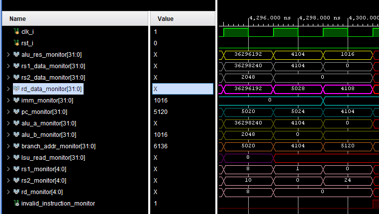
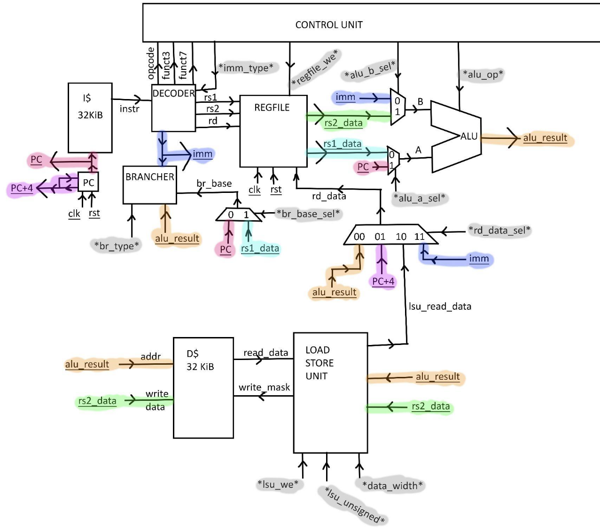

# Ruby-Geyser-RV32I
Basic RV32I core implemented in SystemVerilog supporting all instructions except EBREAK and ECALL. The included instruction_memory.mem program calculates 11! * sin(2), and should read 36296192 if functioning properly.

- riscv-assertions.asm program runs through the instructions in the RV32I instruction set to verify proper functionality. Some edge cases may be missing. This also relies on manually verifying a few instructions by inspecting the waveform, but once those are "proven" functional, we can use those as a basis to prove all the other instructions.
- sin-calculator.asm calculates sin(x) using a taylor series. 

Block Diagram:

